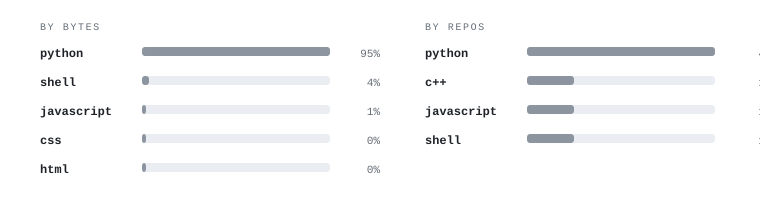

# Sara Monteiro

**Computational Neuroimaging · Neuroinformatics · Data Science · Scientific Software**

## Languages

The chart is generated directly from my public, non-fork repositories and refreshed automatically. It reports both code volume and the number of repositories using each language; Jupyter Notebook is excluded because it is a container format rather than a programming language.

## Current focus

I build reproducible research workflows and software for neuroimaging, clinical data science, and research data management, with an emphasis on transparent methods and usable tools.

[**NIM Studio**](https://github.com/monteiro-sara/NIM-Studio) · [**PET network analysis**](https://github.com/monteiro-sara/PETKLS_3D_Schaefer17_edge_network) · [**Clinical phenotyping**](https://github.com/monteiro-sara/UROFND_UMAP-HDBSCAN)
